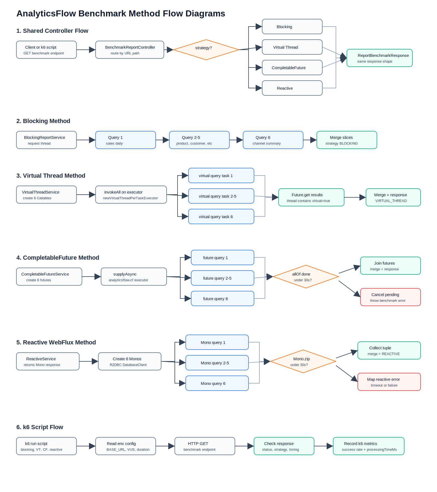
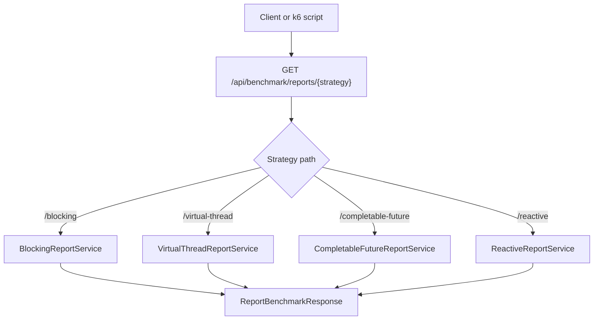
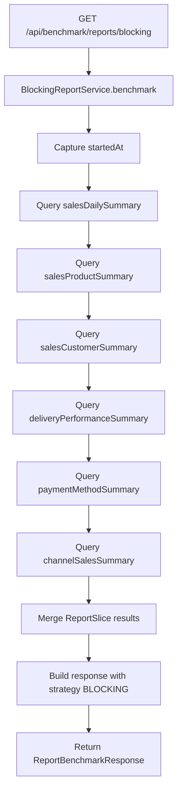
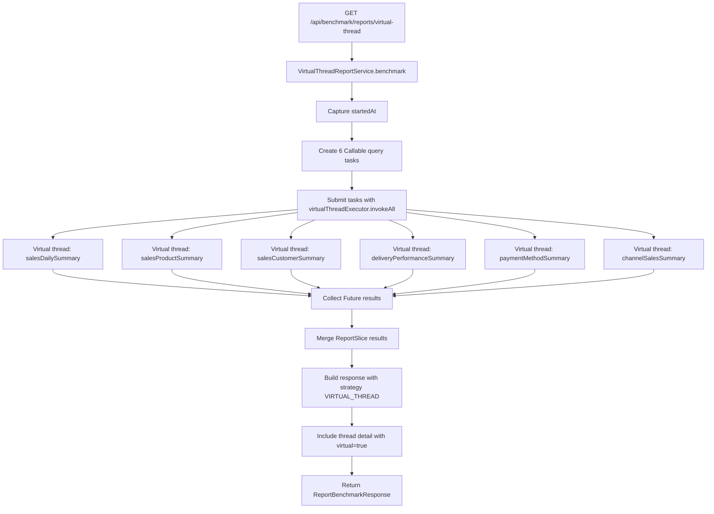
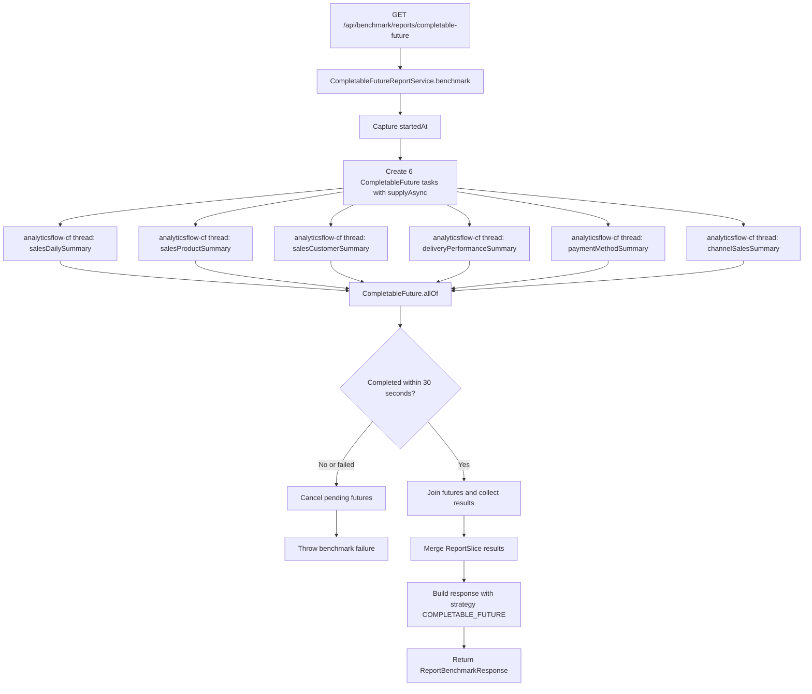
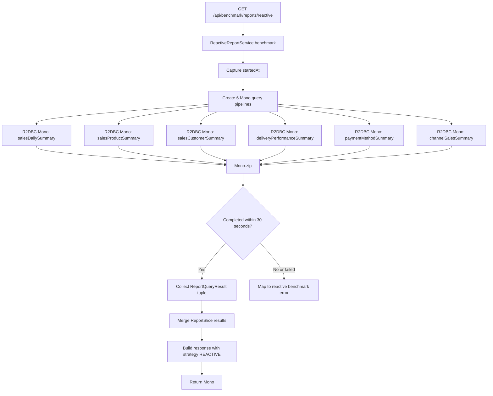
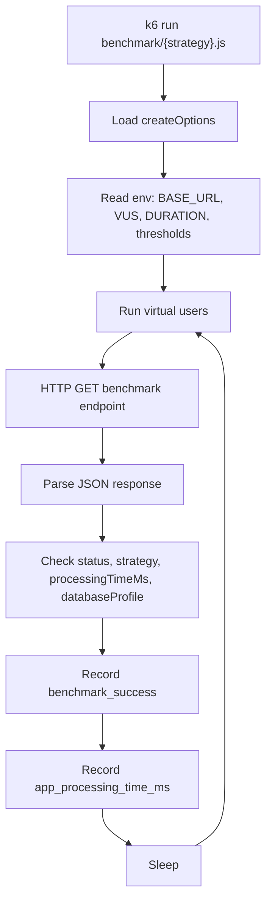

# Benchmark Report Flow Diagrams

Dokumen ini menggambarkan flow empat metode benchmark report di `BenchmarkReportController`.

Versi diagram visual bisa dibuka langsung di [benchmark-flow-diagrams.svg](benchmark-flow-diagrams.svg).



Semua metode pada akhirnya membaca analytical summary tables yang sama:

```text
sales_daily_summary
sales_product_summary
sales_customer_summary
delivery_performance_summary
payment_method_summary
channel_sales_summary
```

## Shared Controller Flow



## 1. Blocking Method

Blocking method menjalankan semua query analytical secara sinkron pada request thread yang sama.



Core behavior:

- Uses `BlockingAnalyticsReportRepository`.
- Queries run one by one.
- Thread name comes from the current HTTP request thread.

## 2. Virtual Thread Method

Virtual thread method tetap memakai blocking repository, tetapi setiap query dijalankan sebagai task di virtual thread executor.



Core behavior:

- Uses `Executors.newVirtualThreadPerTaskExecutor()`.
- Global virtual thread mode is not enabled.
- Blocking DB calls run inside virtual threads.
- Executor is closed through Spring bean lifecycle.

## 3. CompletableFuture Method

CompletableFuture method menjalankan semua query analytical secara parallel memakai executor khusus.



Core behavior:

- Uses dedicated `analyticsCompletableFutureExecutor`.
- Thread prefix is `analyticsflow-cf-`.
- Combines tasks with `CompletableFuture.allOf`.
- Applies 30-second timeout.
- Cancels pending futures on failure.

## 4. Reactive WebFlux Method

Reactive method memakai R2DBC repository dan menggabungkan semua query dengan `Mono.zip`.



Core behavior:

- Uses `ReactiveAnalyticsReportRepository`.
- Actual implementation uses R2DBC `DatabaseClient`.
- No JPA blocking call is wrapped here.
- If this endpoint is ever changed to JPA, the blocking work must run on a bounded elastic scheduler.

## k6 Script Flow

Semua k6 scripts memakai helper yang sama di `benchmark/lib/benchmark.js`.


