# Reporting Flow Diagrams

Dokumen ini menggambarkan flow proses reporting di AnalyticsFlow, mulai dari generate manual, initial report dari batch, list/detail/download, sampai flow masing-masing `ReportType`.

Versi diagram visual bisa dibuka langsung di [reporting-flow-diagrams.svg](reporting-flow-diagrams.svg).

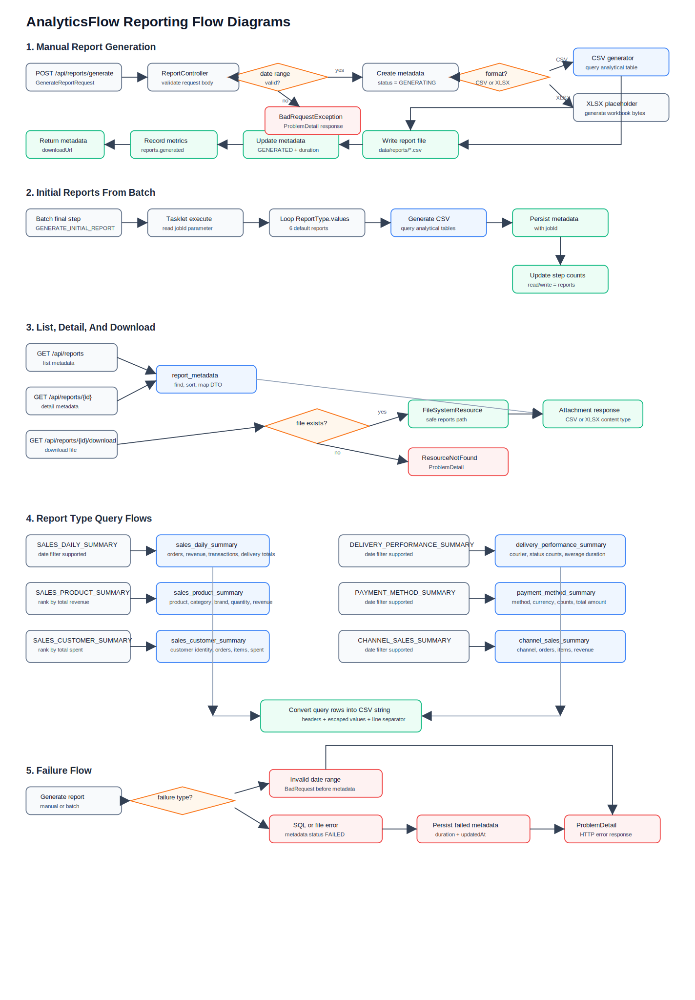

## Shared Reporting Components

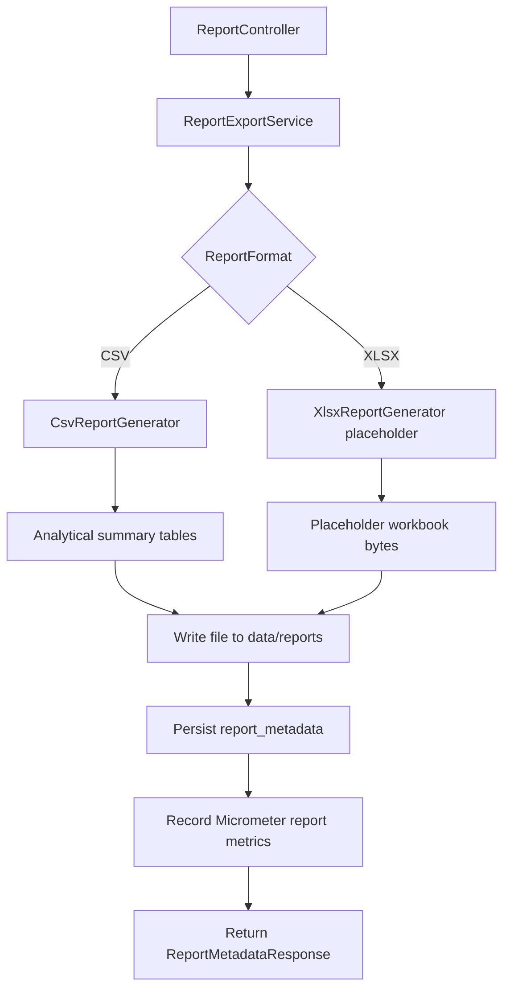

## 1. Manual Report Generation

Endpoint:

```http
POST /api/reports/generate
```

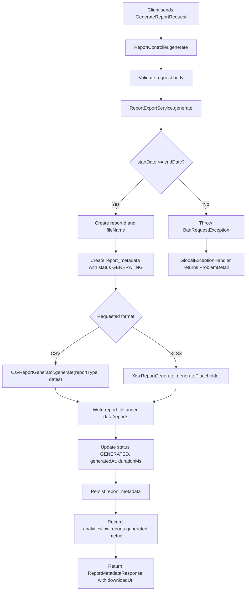

## 2. Initial Reports From Batch

Initial reports are generated by the last ETL job step: `GENERATE_INITIAL_REPORT`.

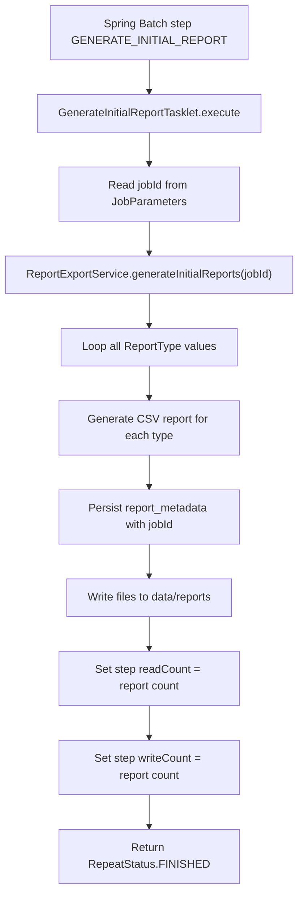

## 3. List And Detail Reports

Endpoints:

```http
GET /api/reports
GET /api/reports/{reportId}
```

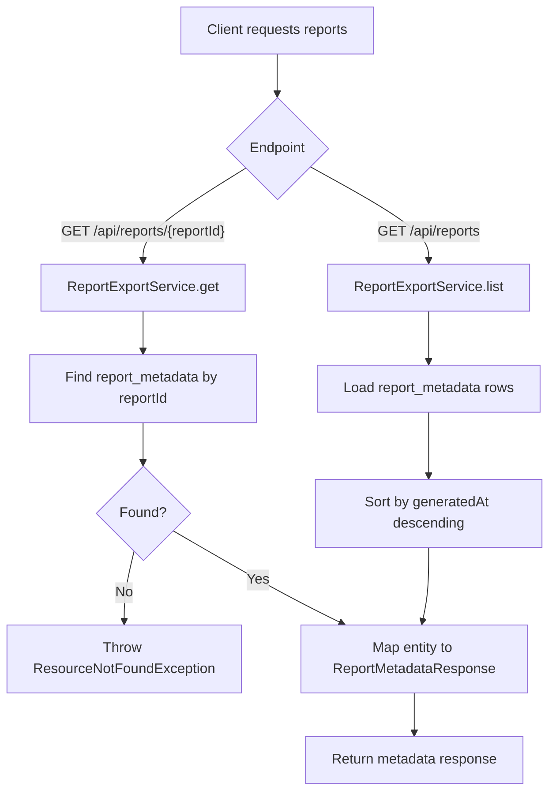

## 4. Download Report

Endpoint:

```http
GET /api/reports/{reportId}/download
```

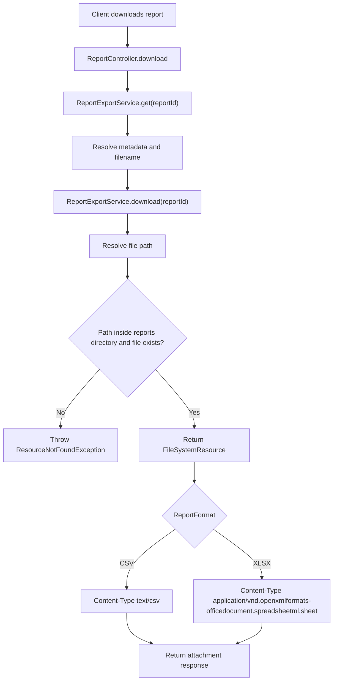

## 5. SALES_DAILY_SUMMARY Report

Source table: `sales_daily_summary`

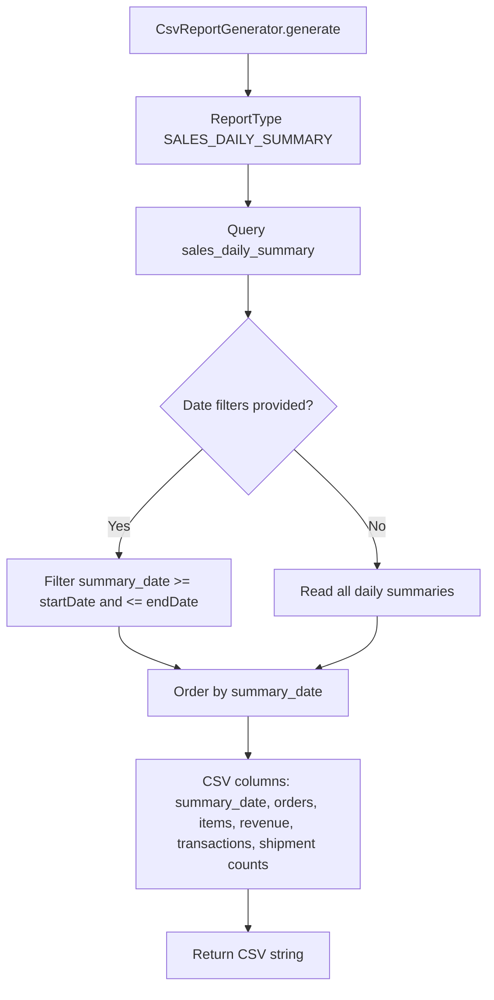

## 6. SALES_PRODUCT_SUMMARY Report

Source table: `sales_product_summary`

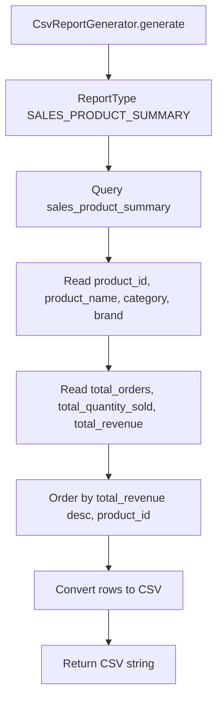

## 7. SALES_CUSTOMER_SUMMARY Report

Source table: `sales_customer_summary`

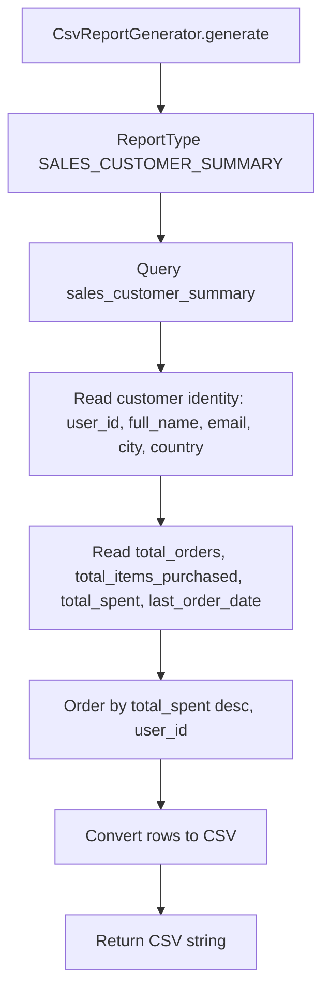

## 8. DELIVERY_PERFORMANCE_SUMMARY Report

Source table: `delivery_performance_summary`

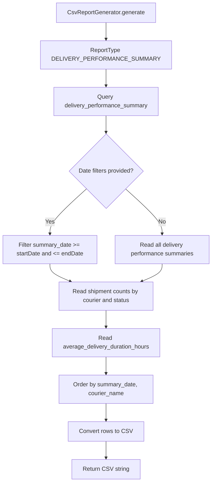

## 9. PAYMENT_METHOD_SUMMARY Report

Source table: `payment_method_summary`

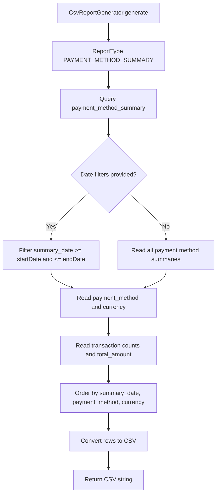

## 10. CHANNEL_SALES_SUMMARY Report

Source table: `channel_sales_summary`

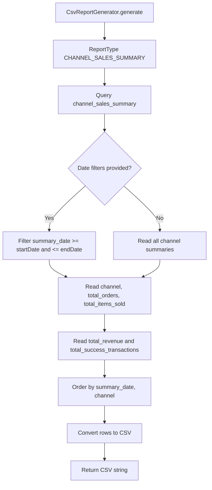

## 11. Failure Flow

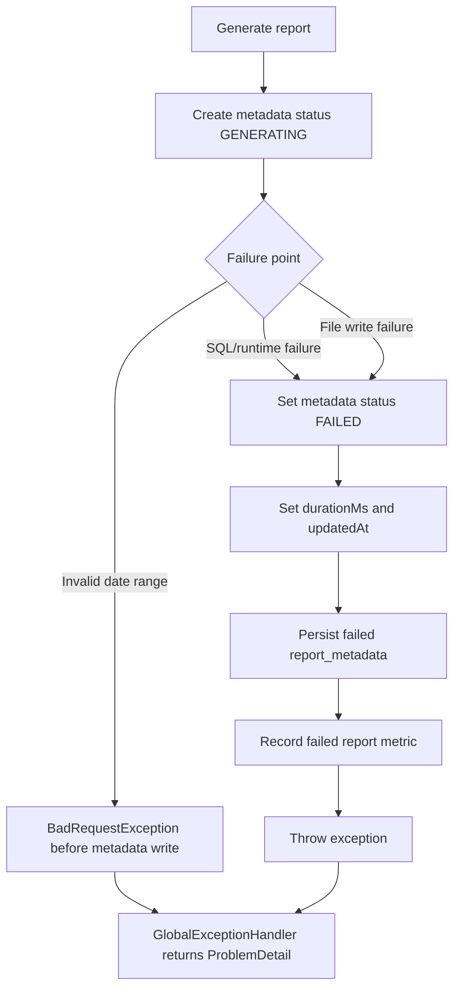
